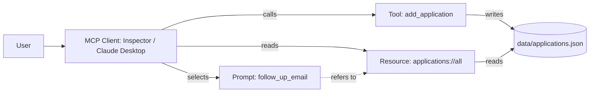

# Job Application Tracker (FastMCP)

**Use case:** Job hunting means juggling many applications, statuses and follow-ups.
This server lets an assistant log applications, see the whole pipeline, and draft
follow-up emails without me copy-pasting anything.

## Why each primitive
- **Tool - `add_application`:** it *changes* state (writes a record) and the model
  should decide to call it mid-conversation ("I just applied to Acme"). Actions = tools.
- **Resource - `applications://all`:** pure data at a URI, no side effects. The client
  pulls it into context when needed. Data you read = resource.
- **Prompt - `follow_up_email`:** a reusable instruction template the *user* picks on
  purpose, with arguments. Human-selected template = prompt.

## Diagram


## Project structure
- `server.py` - the FastMCP server with the 3 primitives
- `data/applications.json` - created at runtime; local storage (git-ignored)
- `pyproject.toml` - dependencies (fastmcp)
- `.gitignore` - keeps secrets, venv and local data out of git

## Run
```
pip install fastmcp
fastmcp dev server.py      # opens MCP Inspector
```
