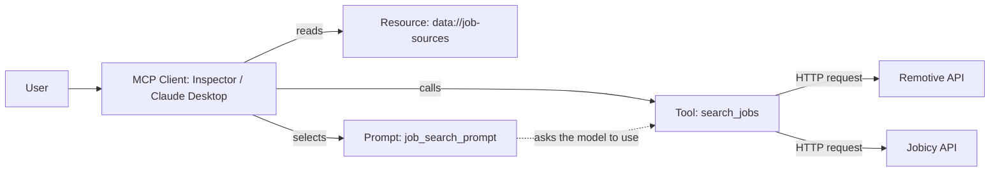

# Job Vacancy Finder (FastMCP)

**Use case:** Looking for a job means checking many sites just to see what is open right now.
This server lets an assistant search current remote vacancies for any role I ask about,
pulling from two job sites at once and showing the company, location, salary and apply link,
so I don't have to open each site myself.

## Why each primitive
- **Tool - `search_jobs`:** it *does* something (fetches live vacancies from the internet)
  and the model should decide to call it mid-conversation ("find me python developer jobs").
  Actions = tools.
- **Resource - `data://job-sources`:** pure reference text with no side effects. It explains
  where the data comes from and what its limits are, and the client reads it when needed.
  Data you read = resource.
- **Prompt - `job_search_prompt`:** a reusable instruction template the *user* picks on
  purpose, with arguments (role, experience level). Human-selected template = prompt.

## Diagram


**How it flows:** I talk to an MCP client (the Inspector or Claude Desktop). It can call the
tool, read the resource, or use the prompt. When the tool runs, it asks both job APIs, joins
the results and sends them back with source links. If one API is down, the other still works
and the answer says which one failed.

## Features
- Searches **Remotive** and **Jobicy** at the same time and combines the results.
- Shows salary only when the posting lists it, otherwise "Not listed". It never guesses.
- Every result has its source and a direct link to the original posting.
- Keeps working if one of the two sources is unreachable.

## Project structure
- `server.py` - the FastMCP server with the 3 primitives, each with a docstring
- `pyproject.toml` - dependencies (fastmcp, httpx)
- `uv.lock` - locked dependency versions
- `.gitignore` - keeps the venv, caches and secrets out of git
- `README.md` - this file

## Run
```
git clone https://github.com/potdarchinmay3007/mcp-assinmnent.git
cd mcp-assinmnent
uv sync
uv run fastmcp dev server.py      # opens MCP Inspector
```
No API keys are needed, because both job sources are free and public.

Then in the Inspector: click **Connect**, open **Tools** > `search_jobs`, type a role like
`python developer` and click **Run Tool**. Check `data://job-sources` under **Resources** and
`job_search_prompt` under **Prompts**.

## Example output
```
Title: <job title>
Company: <company name>
Location: <where the candidate must be based>
Type: <full-time, contract, ...>
Salary: <range, or "Not listed">
Posted: <date>
Link: <apply link>
Source: Remotive or Jobicy
```

## Limitations
- **Remote jobs only.** On-site and local listings are not included.
- **Not every portal.** LinkedIn, Naukri and Indeed have no free public API, so they are not covered.
- **Listings can be delayed,** so a job may already be filled.
- **Salary is often missing,** because many postings don't publish it.

## Credits
Job data comes from the public APIs of [Remotive](https://remotive.com) and
[Jobicy](https://jobicy.com). Every job links back to its original listing.
